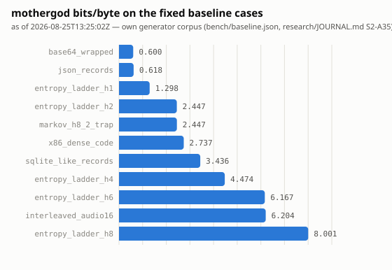

<!-- Generated by `cargo run -p mothergod-bench --release --bin render_baseline_graph`. Do not hand-edit; re-run the generator instead. -->

# Baseline snapshot

As of 2026-08-25T13:25:02Z. Source: `bench/baseline.json`, measured by `mothergod::compress` on 11 fixed-seed, 50,000-byte cases (`research/JOURNAL.md` S2-A35) — mothergod's own generator corpus, not the pinned Silesia/Canterbury held-out finals (ROADMAP M2, still landing). No gzip/zstd/xz comparison here yet: that needs the finals fetch (`research/JOURNAL.md` S2-D1) and a reference-compressor harness, neither of which exists in this crate yet.

| case | bits/byte |
|---|---|
| `base64_wrapped` | 0.600480 |
| `json_records` | 0.618080 |
| `entropy_ladder_h1` | 1.298080 |
| `entropy_ladder_h2` | 2.446560 |
| `markov_h8_2_trap` | 2.447040 |
| `x86_dense_code` | 2.737120 |
| `sqlite_like_records` | 3.436000 |
| `entropy_ladder_h4` | 4.473760 |
| `entropy_ladder_h6` | 6.166560 |
| `interleaved_audio16` | 6.204320 |
| `entropy_ladder_h8` | 8.000960 |
